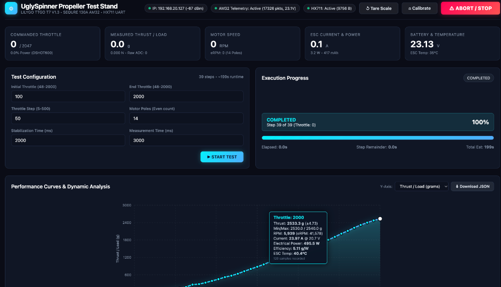

# ESP32 Automated Motor & Propeller Test Stand Firmware

Firmware for the **LILYGO TTGO T7 V1.3 Mini32 (ESP32)** automating static motor and propeller thrust testing.

The system commands an **AM32** electronic speed controller (e.g. **SEQURE 130A ESC**) using high-speed digital **DShot600/300**, decodes real-time **KISS/AM32 ESC telemetry**, measures mechanical thrust/load from an **HX711 UART load cell module**, orchestrates multi-step ramp tests, visualizes real-time performance on a self-contained web dashboard, and exports datasets in standard JSON format.



---

## 1. System Architecture & Features

* **Controller**: LILYGO TTGO T7 V1.3 (ESP32 @ 240MHz, 4MB Flash, 1.25MB RAM).
* **Motor Control**: Hardware-timed DShot600 via ESP32 RMT peripheral with fail-safe watchdog.
* **ESC Telemetry**: KISS/AM32 ESC AutoTelemetry protocol (115200 baud, 8N1, CRC8 checked).
* **Thrust Measurement**: HX711-based UART load cell bridge driver with pluggable protocol parsing and zero-tare calibration.
* **Multitasking Core**: FreeRTOS architecture separating motor pulse feeding, telemetry decoding, load acquisition, automated test sequencing, and HTTP serving across dual Xtensa cores.
* **Safety Core**: 
  - Failsafe throttle: Hardware and software force 0 throttle upon boot, reset, Wi-Fi initialization, WebServer initialization, client disconnection, watchdog timeouts, invalid configuration, or malformed HTTP packets.
  - Prominent red Emergency ABORT button in web UI.
  - Pre-test zero throttle verification and ESC arming delay.
* **Modern Web Interface**: Responsive, self-contained single-page dashboard served directly from ESP32 Flash memory (zero CDN dependencies).
* **Data Visualization & Export**: Interactive SVG performance curves (Thrust vs. Throttle, RPM, Current, Efficiency g/W) with error bars ($\pm \text{StdDev}$), tabular data, and full JSON dataset download.
* **Bench Simulation**: Built-in compile-time `MOCK_ESC` and `MOCK_LOADCELL` simulation modes for complete desk testing without spinning a motor.

---

## 2. Bill of Materials (Known Hardware)

The following components comprise the validated, battle-tested hardware configuration:

| Component | Hardware / Model | Specifications & Configuration | Notes |
| :--- | :--- | :--- | :--- |
| **ESP32 Board** | **LILYGO TTGO T7 V1.3 Mini32** | ESP32-D0WDQ6-V3 @ 240MHz, 4MB Flash, internal PSRAM, USB-C | Avoid GPIO 16/17 (physically tied to internal PSRAM bus). |
| **Electronic Speed Controller (ESC)** | **SEQURE SQESC 14130 (130A)** | 6S–14S high-voltage ESC running AM32 firmware (v2.19+) | Enable **Auto Telemetry** in AM32 Configurator. Wire dedicated `TLM` pad to GPIO 32. |
| **Load Cell (Sensor)** | **Straight Bar / Parallel Beam Strain Gauge** | 5 kg, 10 kg, or 20 kg (sized to expected peak motor thrust) | 4-wire Wheatstone bridge (`E+`, `E-`, `A+`, `A-`) connected to HX711 board. |
| **Load Cell Digitizer Module** | **HX711 UART Serial Module** | 24-bit ADC with onboard microcontroller outputting serial stream @ 9600 baud | Supports both ASCII lines (`=000.77\r\n`, `W: ...`) and binary packets. Connected to UART2 (GPIO 22/21). |
| **Brushless Motor** | Brushless Outrunner (e.g. 22xx–28xx series) | 14 poles (7 pole pairs) typical | Configurable pole count in web UI and `src/config.h`. |
| **Main Battery / Power Supply** | LiPo Battery / Bench Power Supply | 4S–6S (e.g. 22.2V–25.2V 6S) rated for expected motor current draw | Power ground and ESP32 GND must be bonded together in a star-ground topology. |
| **Reference Calibration Weight** | Precision test weight | 500 g or 1000 g certified weight | Used with web UI **Calibrate** button to calibrate scale factor. |
| **Enclosure** | **3D Printed Case & Lid** | Parametric OpenSCAD model (`case.scad`) & ready-to-print mesh (`case.stl`) | Protective electronics enclosure for the ESP32 and wiring. |

---

## 3. Hardware Wiring & Pin Assignments

> **IMPORTANT BOARD NOTE**:  
> The **LILYGO TTGO T7 V1.3** is an ESP32 board equipped with internal PSRAM. Pins **GPIO 16** and **GPIO 17** are physically connected to the internal PSRAM bus. Connecting peripherals to GPIO 16/17 will crash the ESP32.  
> This firmware routes the second hardware UART (`UART2`) to **GPIO 22 (RX)** and **GPIO 21 (TX)** on the outer right header, right above 5V and GND, ensuring conflict-free operation.

### Wiring Table

| Signal | ESP32 TTGO T7 Pin | External Device | Device Pin / Wire | Notes |
| :--- | :--- | :--- | :--- | :--- |
| **DShot Signal** | **GPIO 25** | SEQURE 130A ESC | Signal Wire (White/Yellow) | RMT TX Channel 0 |
| **DShot Ground** | **GND** | SEQURE 130A ESC | Signal Ground (Black) | Common ground reference |
| **ESC Telemetry** | **GPIO 32** | SEQURE 130A ESC | Telemetry TX (KISS/AM32 pad) | UART1 RX (115200 baud) |
| **Load Cell RX** | **GPIO 22** | HX711 UART Module | TX Pin | UART2 RX (9600 baud) |
| **Load Cell TX** | **GPIO 21** | HX711 UART Module | RX Pin (optional) | UART2 TX (for tare cmd) |
| **Module VCC** | **5V / VBUS** | HX711 UART Module | VCC (5V or 3.3V) | Outer header pin 8 |
| **System Ground** | **GND** | All Peripherals | GND | **Star-ground topology** |

```
                 +-----------------------------+
                 |  LILYGO TTGO T7 V1.3 ESP32  |
                 |                             |
                 |  [GPIO 25]  -----(Signal)----> [ESC Signal]   SEQURE 130A
                 |  [GND]      <====(Ground)====> [ESC Ground]   AM32 ESC
                 |  [GPIO 32]  <----(TLM TX)----- [ESC Telemetry]
                 |                             |
                 |  [GPIO 22]  <----(UART TX)---- [TX]  HX711 UART
                 |  [GPIO 21]  -----(UART RX)---> [RX]  Load Cell Module
                 |  [5V / VBUS]-----(Power)-----> [VCC]
                 |  [GND]      <====(Ground)====> [GND]
                 +-----------------------------+
```

---

## 4. Explanation of DShot Throttle Units

DShot is a digital protocol transmitting 16-bit serial frames to the ESC. Unlike analog PWM (1000µs–2000µs), DShot is immune to electrical noise and requires no throttle range calibration.

Each 16-bit DShot frame comprises:
* **11 bits** : Commanded value (0 to 2047)
* **1 bit**  : Telemetry request flag
* **4 bits** : CRC checksum `(value ^ (value >> 4) ^ (value >> 8)) & 0x0F`

### Throttle Range Mapping

| Commanded Value | Meaning / Action | Percentage |
| :--- | :--- | :--- |
| **`0`** | **Motor STOP / Disarmed** (Failsafe state) | `0.0%` (Motor disabled) |
| **`1 .. 47`** | **Reserved DShot Commands** (Beep, Direction reversal, Save) | N/A |
| **`48`** | **Minimum Spin Throttle** | `0.05%` (Lowest running speed) |
| **`500`** | Low-mid power range | `22.6%` |
| **`1048`** | Mid-throttle range | `50.0%` |
| **`1500`** | High-power range | `72.6%` |
| **`2047`** | **Maximum Full Throttle** | `100.0%` |

Conversion formula from commanded throttle $T \in [48, 2047]$ to percentage $P$:
$$P = \frac{T - 48}{2047 - 48} \times 100\%$$

---

## 5. Explanation of ESC Telemetry RPM / eRPM Conversion

AM32 and KISS ESCs transmit **Electrical RPM (eRPM)** across the serial telemetry line.

* **eRPM (Electrical RPM)** represents the frequency at which the magnetic field rotates around the motor stator windings.
* **Mechanical RPM (Shaft RPM)** is the actual physical rotation speed of the motor bell and propeller.

A brushless motor contains a specific number of magnetic poles $N$ mounted on the rotor bell (always an even number, commonly 14 poles for 22xx/23xx/28xx motors). The number of magnetic pole pairs $P$ is:
$$P = \frac{N}{2}$$

Because one mechanical rotation requires the magnetic field to pass through all pole pairs:
$$\text{eRPM} = \text{Mechanical RPM} \times \left(\frac{\text{Motor Poles}}{2}\right)$$

Therefore, the mechanical shaft RPM is calculated as:
$$\text{Mechanical RPM} = \frac{\text{eRPM} \times 2}{\text{Motor Poles}}$$

*Example (14 Pole Motor)*:
$$\text{Pole Pairs} = \frac{14}{2} = 7$$
$$\text{If eRPM} = 84,000 \implies \text{Mechanical RPM} = \frac{84,000}{7} = 12,000\text{ RPM}$$

This firmware automatically logs both raw `erpm` and calculated mechanical `rpm`. The motor pole count can be adjusted in `src/config.h` or directly through the web UI before each test run.

---

## 6. Software Architecture & FreeRTOS Tasks

```
  Core 0:                                     Core 1:
+-----------------------------------+       +-----------------------------------+
|  WiFi & Network Management        |       |  DShotMotorTask (100 Hz, Pri Max) |
|  - STA connection & AP fallback   |       |  - RMT DShot pulse feeder         |
|                                   |       |  - Watchdog monitor & safety stop |
|  HTTP Web Server Task             |       |                                   |
|  - Serving HTML/JS UI (PROGMEM)   |       |  EscTelemetryTask (Pri Max - 2)   |
|  - REST endpoints (/api/status,   |       |  - UART1 KISS decoder + CRC8      |
|    /api/start, /api/abort, etc.)  |       |                                   |
+-----------------+-----------------+       |  LoadCellTask (Pri Max - 2)       |
                  |                         |  - UART2 HX711 parser             |
                  |                         |                                   |
                  v                         |  TestRunnerTask (Pri 4)           |
          Shared Mutex-Protected            |  - State machine sequencer        |
             Results & Status  <------------+  - Step stabilization & sampling  |
                                            +-----------------------------------+
```

---

## 7. Configuration & Compilation

The project uses [PlatformIO](https://platformio.org/).

### Configuration File (`src/config.h`)

Open `src/config.h` to customize:
* **Wi-Fi Credentials**:
  ```cpp
  #define WIFI_DEFAULT_SSID       "YourWiFiNetwork"
  #define WIFI_DEFAULT_PASSWORD   "YourWiFiPassword"
  ```
  *(Note: If Wi-Fi fails to connect within 10 seconds, the ESP32 automatically launches an Access Point named `UglySpinner-TestStand` with password `spinnertest` at IP `192.168.4.1`).*
* **Mock Modes**:
  ```cpp
  #define MOCK_ESC                1   // 1 = Simulation, 0 = Hardware SEQURE 130A ESC
  #define MOCK_LOADCELL           1   // 1 = Simulation, 0 = Hardware HX711 UART
  ```
* **Hardware Pins**:
  ```cpp
  #define PIN_DSHOT_SIGNAL        GPIO_NUM_25
  #define PIN_ESC_TELEMETRY_RX    GPIO_NUM_32
  #define PIN_LOADCELL_RX         GPIO_NUM_22
  #define PIN_LOADCELL_TX         GPIO_NUM_21
  ```

### Build Instructions

1. **Build the firmware**:
   ```bash
   pio run
   ```
2. **Flash to TTGO T7 V1.3**:
   ```bash
   pio run --target upload
   ```
3. **Open Serial Monitor**:
   ```bash
   pio device monitor -b 115200
   ```

---

## 8. Desk / Mock-Mode Testing Instructions

To test the complete workflow (web interface, live telemetry updates, interactive charts, abort handling, and JSON export) on your desk before connecting high-power batteries:

1. In `src/config.h`, set:
   ```cpp
   #define MOCK_ESC         1
   #define MOCK_LOADCELL    1
   ```
2. Build and upload: `pio run -t upload`.
3. Open the Serial Monitor. Observe the IP address:
   ```
   [Wi-Fi] Connection established successfully!
   [Wi-Fi] IP Address: http://192.168.1.150/
   ```
4. Open `http://192.168.1.150/` in any web browser.
5. In the **Test Configuration** panel:
   * Initial Throttle: `100`
   * End Throttle: `1000`
   * Step: `100`
   * Stabilization: `1500 ms`
   * Measurement: `2000 ms`
6. Click **`START TEST`**.
7. Observe:
   * Real-time KPI cards updating at 2Hz (Throttle, Load, RPM, Current, Voltage, Temp).
   * Progress bar filling smoothly.
   * Emergency **`ABORT`** test: Click the red button midway through a run. Notice the motor drops to 0 instantly and marks state as `ABORTED`.
8. Complete a full run:
   * The interactive SVG curve renders automatically.
   * Hover over data points to inspect thrust error bars, efficiency, and telemetry.
   * Click **`Download JSON`** to verify the exported dataset.

---

## 9. First-Power-Up Safety Procedure (Propeller Removed)

> [!CAUTION]
> **NEVER ATTACH A PROPELLER DURING FIRST POWER-UP AND CALIBRATION.**  
> A brushless motor on 4S–8S LiPo can cause severe injury if it spins unexpectedly.

Follow this strict checklist when commissioning real hardware (`MOCK_ESC = 0` and `MOCK_LOADCELL = 0`):

1. **Propeller OFF**: Remove all propellers, nuts, and adapters from the motor shaft.
2. **Mounting**: Ensure the motor and test stand are securely clamped to a heavy workbench.
3. **Firmware Configuration**: Set `MOCK_ESC = 0` and `MOCK_LOADCELL = 0` in `src/config.h`. Compile and upload.
4. **Power ESP32 First**: Connect the ESP32 via USB. Open the Serial Monitor at 115200 baud.
   * Confirm console output reads: `[Safety] Enforcing initial zero-throttle state...`
   * Confirm the web page is accessible at the reported IP address.
5. **Power ESC Main Battery**: Connect the LiPo battery to the SEQURE 130A ESC.
   * Listen for the AM32 initialization chime (3 rising beeps indicating power-up, followed by 2 beeps indicating zero-throttle signal detected).
   * If you hear continuous beeping, check GPIO 25 ground reference.
6. **Telemetry Verification**:
   * Inspect the web dashboard. The status badge should show: `AM32 Telemetry: Active`.
   * Current voltage should show your LiPo voltage (e.g., `~25.2V` for 6S).
7. **Motor Spin Direction Test**:
   * Set Initial Throttle = `50`, End Throttle = `60`, Step = `10`, Stabilization = `1000`, Measurement = `1000`.
   * Click **START TEST**.
   * Observe the bare motor shaft spinning smoothly and verify rotational direction.
   * Verify mechanical RPM appears on the dashboard.
8. **Emergency Abort Verification**:
   * Start another low-throttle test and press **ABORT / STOP**.
   * Verify the motor halts within milliseconds.
9. **Loaded Propeller Test**:
   * Only after steps 1–8 succeed: disconnect battery, mount propeller, clear test stand radius of all personnel and loose objects, put on eye protection, and power on.

---

## 10. Hardware Validation & Parser Adaptation

### HX711 UART Module Validation

Because third-party HX711 UART modules utilize different bridge firmware:
1. Connect module TX to GPIO 22 and RX to GPIO 21.
2. The firmware includes an auto-detecting parser in `src/loadcell/loadcell.cpp`:
   * **Binary format**: `[0xAA, 0x55, 4-byte signed raw ADC, Checksum]`
   * **Binary format**: `[0xAA, 0x02, 3-byte 24-bit raw ADC, Checksum]`
   * **ASCII format**: Lines like `W: 123.4 g\r\n`, `=000.77\r\n`, or `+001.234\r\n`
3. If your module uses a proprietary protocol:
   * Open `src/loadcell/loadcell.cpp`.
   * Locate the clearly marked function `UARTLoadCell::parseFrame()`.
   * Adjust packet header and byte offsets according to your module's datasheet.
4. Scale calibration & Tare:
   * Click **Tare Scale** in the web UI with the stand unloaded to zero the load cell.
   * Place a known calibration weight (e.g. 500g) on the load cell.
   * Click **Calibrate** in the top navigation bar, enter the weight in grams, and the ESP32 will automatically compute and persist the calibration factor.

### AM32 ESC Telemetry Validation

The firmware decodes standard 10-byte KISS/AM32 AutoTelemetry:
* **Physical wire**: ESC `TLM` or `TX` pad connected to TTGO T7 **GPIO 32**.
* **Baud rate**: 115200 baud, 8 data bits, no parity, 1 stop bit (8N1).
* **AM32 ESC Config**: In the AM32 Configurator, verify that **"Auto Telemetry"** or **"KISS Telemetry"** is enabled.

---

## 11. Sample Exported JSON Format

When **`Download JSON`** is clicked, the file `propeller_test_dataset.json` is generated:

```json
{
  "metadata": {
    "firmware_version": "1.0.0",
    "dshot_mode": "DSHOT600",
    "telemetry_protocol": "KISS/AM32",
    "start_time_ms": 123456,
    "run_duration_ms": 38400,
    "initial_throttle": 100,
    "end_throttle": 1500,
    "throttle_step": 100,
    "stabilization_ms": 2000,
    "measurement_ms": 3000,
    "motor_poles": 14,
    "load_cell_zero_offset": 84120,
    "load_units": "grams",
    "status": "COMPLETED",
    "abort_reason": ""
  },
  "points": [
    {
      "throttle": 500,
      "load": {
        "mean": 302.80,
        "min": 295.20,
        "max": 309.40,
        "stddev": 2.840,
        "samples": 120
      },
      "rpm": 7420,
      "erpm": 51940,
      "current_a": 5.60,
      "voltage_v": 24.92,
      "temperature_c": 32.5
    }
  ],
  "raw_samples": [
    {
      "t_ms": 125500,
      "el_ms": 2044,
      "thr": 500,
      "load": 301.40,
      "rpm": 7410,
      "erpm": 51870,
      "curr": 5.58,
      "volt": 24.93,
      "temp": 32.5
    }
  ]
}
```

---

## 12. License & Credits

* Developed for LILYGO TTGO T7 V1.3 & AM32 SEQURE 130A ESC testing.
* Uses [DShotRMT](https://github.com/derdoktor667/DShotRMT) for ESP32 RMT DShot pulse generation.
* Uses [ArduinoJson](https://arduinojson.org/) for memory-efficient JSON serialization.
